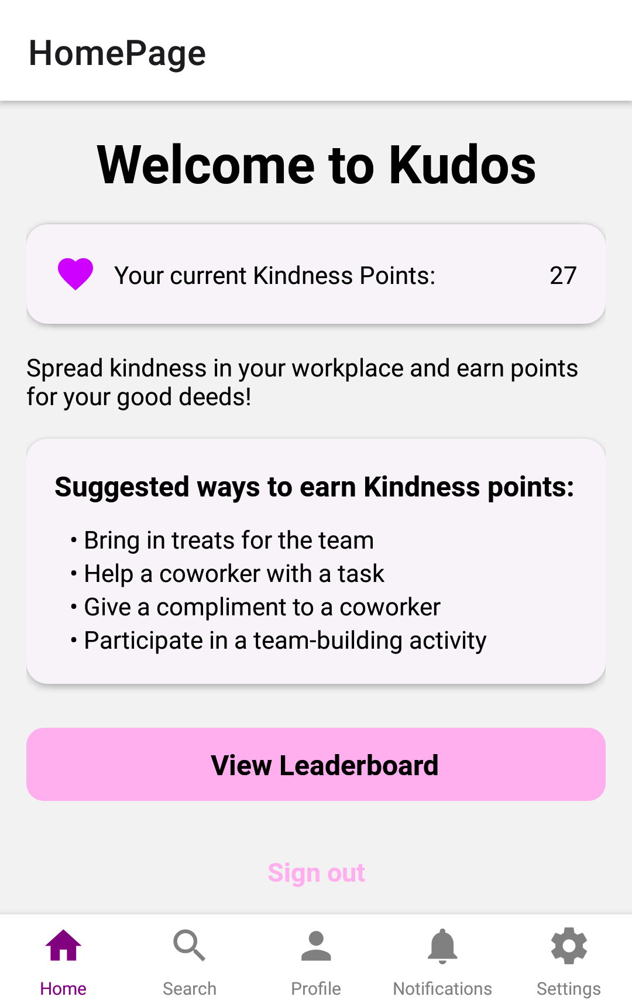

# Kudos

Kudos is a cross-platform mobile app that aims to help employees build stronger relationships with their colleagues through gamifying acts of kindness.

  

## Features

- Search for your colleagues and award them with Kindness Points for doing kind deeds
- Earn Kindness Points and unlock outfits for your avatar
- See who has earned the most Kindness Points on the leaderboard

## Tech Stack

Kudos was built using [React Native](https://reactnative.dev) and [Expo](https://expo.dev), with [Firebase](https://firebase.google.com) as our backend.

## Getting started

1. Install [Node.js](https://nodejs.org) on your computer.
2. Install [Expo Go](https://expo.dev/expo-go) on your Android / iOS device.
3. Run `git clone https://github.com/rexcyrio/kudos.git` to clone this git repository onto your computer.
4. Run `npm install` to install all of the project's dependencies.
5. Run `npm run start` and scan the QR code produced in the terminal window with your Android / iOS device.
   - If you use an Android device, open the Expo Go app and scan the QR code.
   - If you use an iOS device, open the Camera app and scan the QR code.
6. If Expo Go encounters the error `Network response timed out` after scanning the QR code, either adjust your firewall rules to allow Node.js through or run `npm run dev` instead of `npm run start` in step 5.

## Links

- [Proposal Slide Deck](https://docs.google.com/presentation/d/1Ub2Wv2aZkwr7mKTWjJHnJk4i8Adt83ZFsY4b4chCtXY/)
- [Elevator Pitch](https://www.youtube.com/watch?v=K6Ld_pba2Qo)
- [Figma Wireframe](https://www.figma.com/file/1bqh4S1wHBY1AvhEkzpfa0/CODE_EXP-cat-2-grp-83-Kudos-Wireframe)
- [Architecture Diagram](https://lucid.app/lucidchart/9c7812c0-130d-4e96-a570-fb8bd8d8a08d/edit)

## Authors

- [Stefan Lee](https://github.com/rexcyrio)
- [Jacques Liao](https://github.com/jugsliao)
- [Jethro Sim](https://github.com/gekhro)
- [Darren Sim](https://github.com/BagDownB3nny)
- [Ian Tsai](https://github.com/iantsaii)

## Notes

Kudos was developed during the NUS AY22/23 summer break for the [DSTA BrainHack CODE_EXP hackathon](https://www.dsta.gov.sg/brainhack) held from 5 June 2023 to 22 June 2023.

The problem statement was

> How can gamification be used to enhance employee experience?

and our group managed to qualify for the finals out of more than 500 participants.
